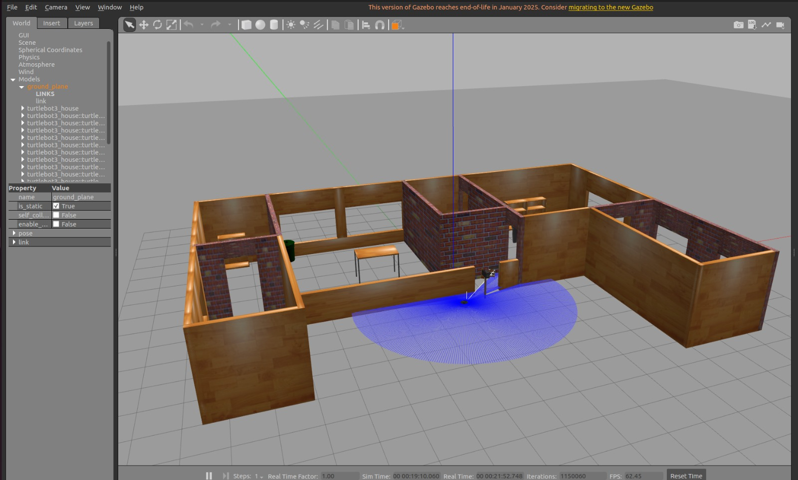
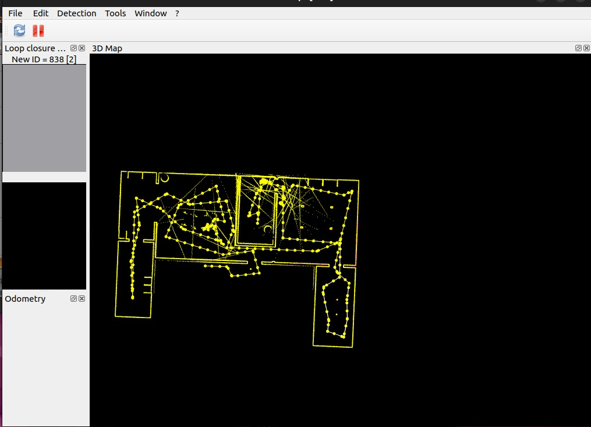
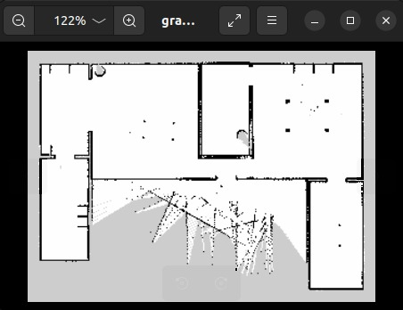

#  Indoor Localization using GraphSLAM (ROS2)

Real-time indoor mapping and localization using GraphSLAM with ROS2 and RTABMap

---

##  Overview

This project implements **indoor localization using GraphSLAM** on a simulated robot.
Since GPS is not available indoors, the robot builds a map and estimates its position simultaneously using onboard sensors.

We implemented this using:

* ROS2 Humble
* TurtleBot3 (simulation)
* RTABMap (GraphSLAM engine)
* g2o (graph optimization backend)

---

##  Problem Statement

Indoor localization is a core robotics challenge where a robot must determine its position without GPS.

Without accurate localization:

* Navigation fails
* Obstacle avoidance becomes unreliable
* Autonomous operation is not possible

---

##  Objective

* Implement a **GraphSLAM pipeline**
* Perform **real-time mapping and localization**
* Demonstrate **loop closure detection**
* Generate a **2D occupancy map**

---

##  How It Works (GraphSLAM Pipeline)

1. Robot collects **LiDAR + Odometry data**
2. Each robot pose → stored as a **node**
3. Movement between poses → **edges (constraints)**
4. Loop closure detection using **ICP**
5. Graph optimization using **g2o**
6. Final **corrected map generated**

---

##  Technologies Used

###  Software

* ROS2 Humble
* Python 3
* RTABMap
* g2o
* RViz2
* Gazebo Classic

###  Libraries

* turtlebot3
* rtabmap_ros
* rtabmap_slam
* nav2_map_server

---

##  Simulation Environment

* Gazebo Classic 11
* TurtleBot3 House World
* Multiple rooms & corridors
* Manual control using keyboard

---

##  Results

###  Key Outcomes

* Generated a **2D occupancy map**
* Successfully detected **loop closures**
* Corrected trajectory using **graph optimization**
* Final map aligned with actual environment

---

##  Output Screenshots

###  House World (Gazebo)



###  Pose Graph (RTABMap)



###  Occupancy Map (RViz2)



---

##  Demo Video

[Watch Demo](https://drive.google.com/file/d/1bYaGJer1HK6FPry-RvEfqvyyKzPy_kww/view)

---

##  Installation & Setup

```bash
git clone https://github.com/Kash1sh600/indoor-graphslam-ros2
cd indoor-graphslam-ros2

colcon build
source install/setup.bash

# Terminal 1: Launch simulation world
ros2 launch my_graphslam world.launch.py

# Terminal 2: Start GraphSLAM (RTABMap)
ros2 launch my_graphslam slam.launch.py

# Terminal 3: Open RViz2 visualization
ros2 launch my_graphslam rviz.launch.py

# Terminal 4: Control robot
ros2 run teleop_twist_keyboard teleop_twist_keyboard
```

---

##  Implementation Steps (What We Did)

###  Dependency Installation

```bash
sudo apt install ros-humble-turtlebot3 ros-humble-turtlebot3-gazebo ros-humble-turtlebot3-simulations -y
sudo apt install ros-humble-rtabmap-ros -y
sudo apt install ros-humble-teleop-twist-keyboard -y
```

---

###  Workspace & Package Setup

```bash
mkdir -p ~/my_graphslam_ws/src
cd ~/my_graphslam_ws/src

ros2 pkg create my_graphslam --build-type ament_python --dependencies rclpy

cd ~/my_graphslam_ws
colcon build --symlink-install
source install/setup.bash
```

---

###  Loop Closure Process

* Robot is driven through multiple rooms
* Returning to the starting position triggers **loop closure**
* RTABMap detects revisited locations using **ICP**
* g2o performs **global graph optimization**
* The entire trajectory is corrected in real-time

---

###  Saving the Map

```bash
ros2 run nav2_map_server map_saver_cli -f ~/my_graphslam_ws/maps/graphslam_map
```

---

##  Codebase Structure

```
my_graphslam/
├── config/
│   └── rtabmap_params.yaml
├── launch/
│   ├── world.launch.py
│   ├── slam.launch.py
│   ├── rviz.launch.py
│   └── world_with_actors.launch.py
├── rviz/
│   └── graphslam.rviz
├── worlds/
│   └── house_with_actors.world
├── my_graphslam/
│   └── __init__.py
├── resource/
│   └── my_graphslam
├── package.xml
├── setup.py
└── README.md
```

---


